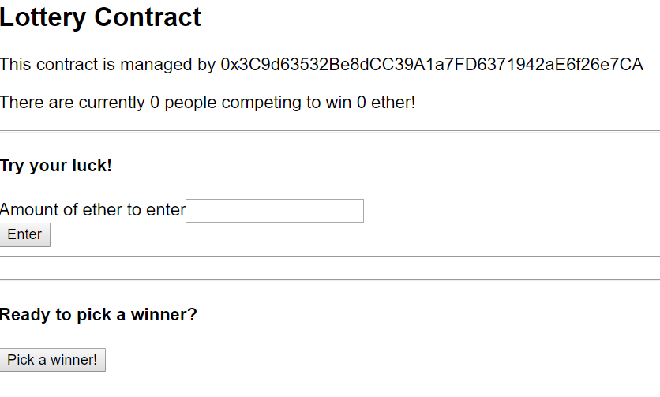

# Lottery Contract

This project allows people to send ether to a contract and participate in a lottery. The manager who creates the contrct is responsible for pushing the button that picks the winner. When a winner is selected, all funds are transfered from the contract to the winning player's account.

The contract has three public functions:
  * Enter Lottery 
    Allows an entity to send ether to this contract 
    If the value is higher than a certain amount, he or she's public address is added to the array of players 
     
  * Get all players 
    Returns all players, instead of just one at a time provided by the native function 
     
  * Pick Winner 
    Accessible only by the manager, transfers the balance of the contract to a psuedo-random entity from the players array
